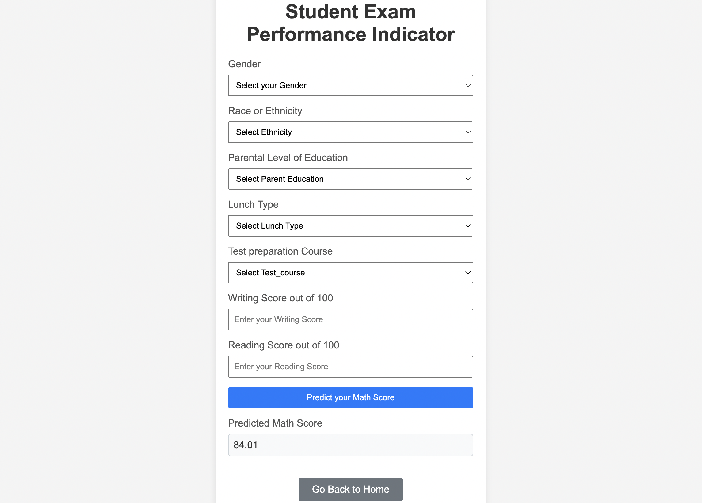

# Student Performance Indicator

## Overview
The Student Performance Indicator is a machine learning application that predicts students' math scores based on a range of input features. This project leverages machine learning models to analyze student performance data and generate predictions.



## Features
- Predictive analysis of student math scores.
- Data analysis and visualization.
- Use of advanced machine learning models for accurate predictions.

## Installation
Clone the repository and install the required packages:

\```bash
git clone `https://github.com/AaryanPotdar/StudentPerformanceIndicator.git`
cd mlproject
pip install -r requirements.txt
\```

## Dependencies
- Pandas
- NumPy
- Seaborn
- Matplotlib
- Scikit-learn
- CatBoost
- XGBoost
- Dill
- Flask

## Usage
To run the application, execute:

\```bash
python app.py
\```

Navigate to the hosted address on a web browser to interact with the application.

## Structure
- `app.py`: Flask application
- `requirements.txt`: requirements
- `home.html` & `index.html`: html templates
- `EDA_STUDENT_PERFORMANCE.ipynb`: Notebook for exploratory data analysis
- `MODEL_TRAINING.ipynb`: Notebook for model training
- `predict_pipeline.py`: prediction pipeline
- `data_ingestion.py`:  data ingestion script
- `data_transformation.py`: data transformation script
- `model_trainer.py`: model training script